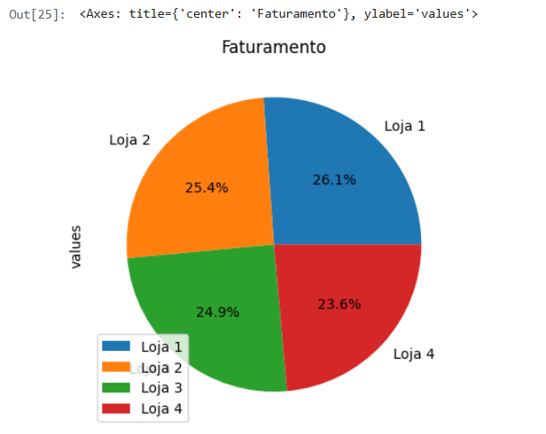
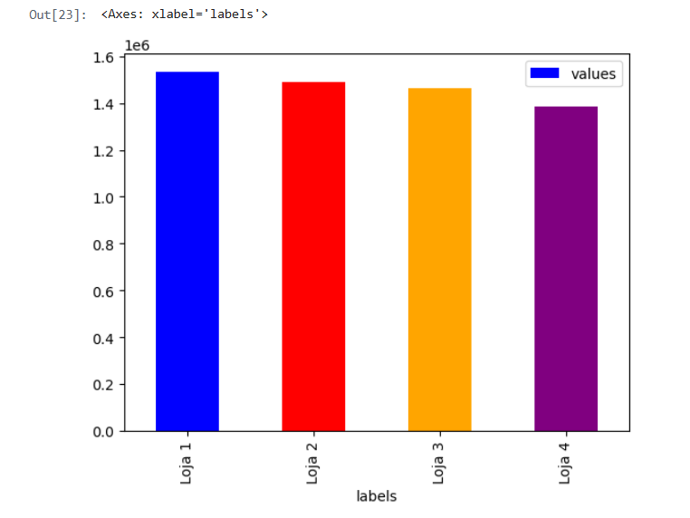
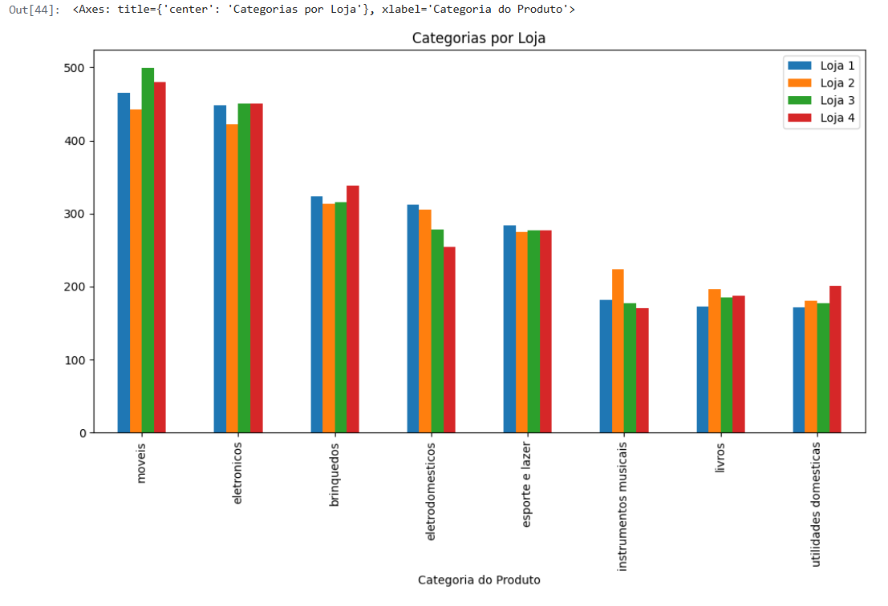
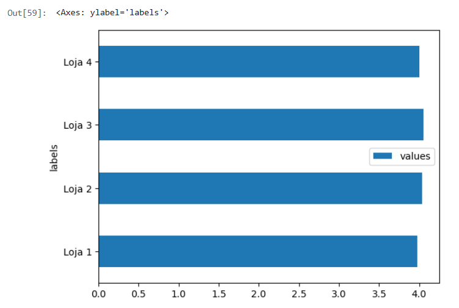
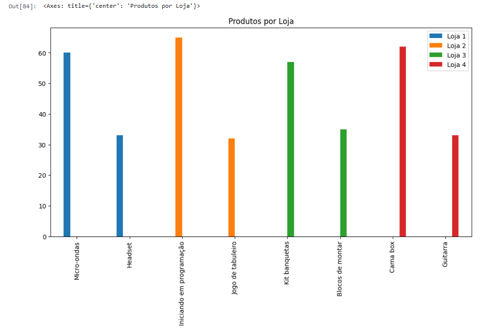
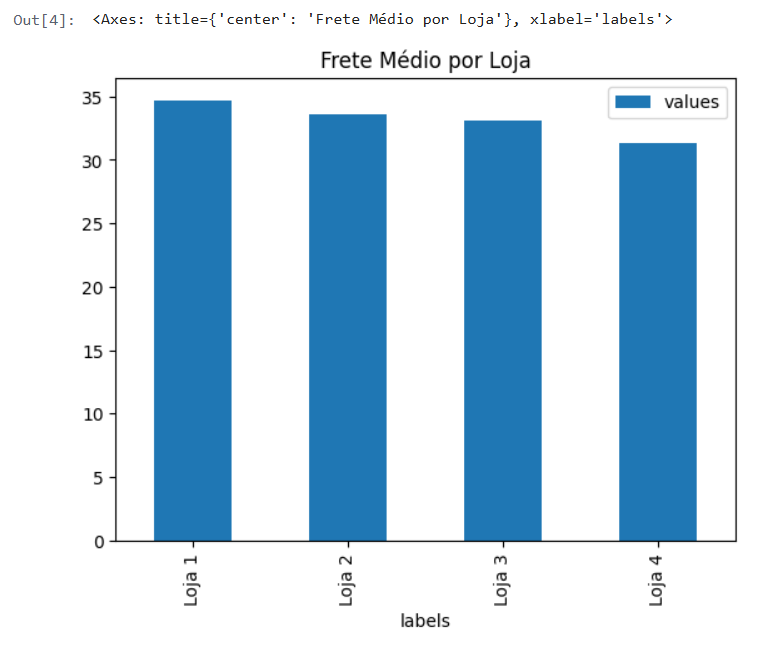

# Alura_StoreBR
O challenge Alura Store se baseia em fazer uma análise de 4 lojas e ajudar o vendedor a decidir qual loja ele deve vender com base nessas análises.

## 1ª - Análise do faturamento
Nessa primeira análise nós precisavamos ver o faturamento de cada loja e criar um gráfico para compararmos.
___
Primeiro criei um array que recebia a soma do faturamento de cada loja e um dicionário para receber os valores.
```python
faturamento = [float(loja.Preço.sum()),float(loja2.Preço.sum()),float(loja3.Preço.sum()),float(loja4.Preço.sum())]

grafico = {
    'labels': ['Loja 1', 'Loja 2', 'Loja 3', 'Loja 4'],
    'values': faturamento
}
```

#### Gráfico Pizza
```python
df = pd.DataFrame(grafico)
df.plot.pie(y='values', labels=df['labels'], autopct='%1.1f%%', title="Faturamento")
```



#### Gráfico de Barras
```python
df.plot.bar(x='labels', y='values', color=["blue", "red", "orange", "purple"])
```



</br>

## 2ª - Vendas por Categoria
Na segunda análise nós precisavamos análisar a venda de cada loja por categoria.
___
Primeiro criei variáveis para receber a quantidade de vendas por categoria de cada loja, concatenei essas variaveis e criei o nome das colunas.
```python
cat1 = loja["Categoria do Produto"].value_counts()
cat2 = loja2["Categoria do Produto"].value_counts()
cat3 = loja3["Categoria do Produto"].value_counts()
cat4 = loja4["Categoria do Produto"].value_counts()

df_categorias = pd.concat([cat1, cat2, cat3, cat4], axis=1)
df_categorias.columns = ['Loja 1', 'Loja 2', 'Loja 3', 'Loja 4']
```

#### Gráfico de Barras
```python
df_categorias.plot(kind='bar', figsize=(12, 6), title='Categorias por Loja')
```



</br>

## 3ª - Média de Avaliação das Lojas
Na terceira precisavamos fazer a média de avaliação de cada loja.
___
Primeiro criei um array que recebia a média de cada loja, arredondando com 2 casas decimais e um dicionário para receber os valores.
```python
medias_ava = [float(round(loja['Avaliação da compra'].mean(), 2)), float(round(loja2['Avaliação da compra'].mean(), 2)), float(round(loja3['Avaliação da compra'].mean(), 2)), float(round(loja4['Avaliação da compra'].mean(), 2))]

grafico_media = {
    'labels': ['Loja 1', 'Loja 2', 'Loja 3', 'Loja 4'],
    'values': medias_ava
}
```

### Gráfico de Barras Horizontal
```python
df = pd.DataFrame(grafico_media)
df.plot.barh(x='labels', y='values')
```



</br>

## 4ª - Produtos Mais e Menos Vendidos
Nessa quarta peganos o produto mais e menos vendido de cada loja.
___
Primeiro criamos variáveis para cada loja que recebe a quantidade de cada produto vendido, depois criamos um dicionário que recebe o nome e o valor do produto mais e menos vendido de cada loja e por fim um dicionário com esses dicionários.
```python
contagem_produtos = loja["Produto"].value_counts()
contagem_produtos2 = loja2["Produto"].value_counts()
contagem_produtos3 = loja3["Produto"].value_counts()
contagem_produtos4 = loja4["Produto"].value_counts()

prod_loja1 = {contagem_produtos.idxmax(): contagem_produtos.max(), contagem_produtos.idxmin(): contagem_produtos.min()}
prod_loja2 = {contagem_produtos2.idxmax(): contagem_produtos2.max(), contagem_produtos2.idxmin(): contagem_produtos2.min()}
prod_loja3 = {contagem_produtos3.idxmax(): contagem_produtos3.max(), contagem_produtos3.idxmin(): contagem_produtos3.min()}
prod_loja4 = {contagem_produtos4.idxmax(): contagem_produtos4.max(), contagem_produtos4.idxmin(): contagem_produtos4.min()}

grafico_prod = {
    'Loja 1': prod_loja1,
    'Loja 2': prod_loja2,
    'Loja 3': prod_loja3,
    'Loja 4': prod_loja4
}
```

### Gráfico de Barras
```python
df_produtos.plot.bar(figsize=(12, 6), title='Produtos por Loja')
```



</br>

## 5ª - Frete Médio por Loja
Na ultima nós vemos o frete médio de cada loja.
___
Primeiro criei um array que recebia a média do frete de cada loja, arredondando com 2 casas decimais e um dicionário para receber os valores.
```python
media_frete = [float(round(loja['Frete'].mean(), 2)), float(round(loja2['Frete'].mean(), 2)), float(round(loja3['Frete'].mean(), 2)), float(round(loja4['Frete'].mean(), 2))]

grafico_frete = {
    'labels': ['Loja 1', 'Loja 2', 'Loja 3', 'Loja 4'],
    'values': media_frete
}
```

### Gráfico de Barras
```python
df = pd.DataFrame(grafico_frete)

df.plot(kind='bar', x='labels', y='values', title='Frete Médio por Loja')
```


